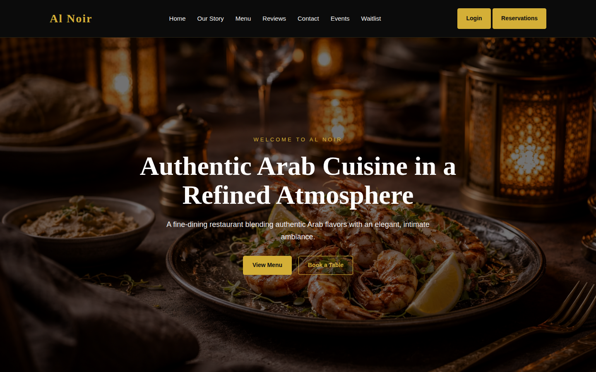
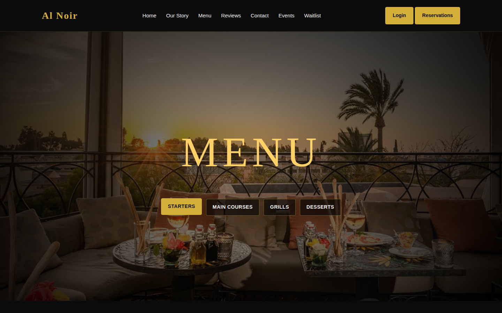
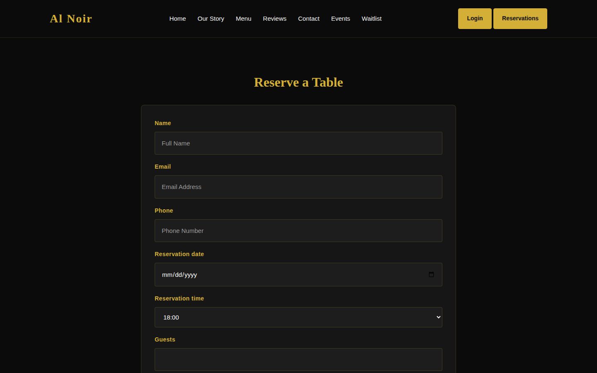
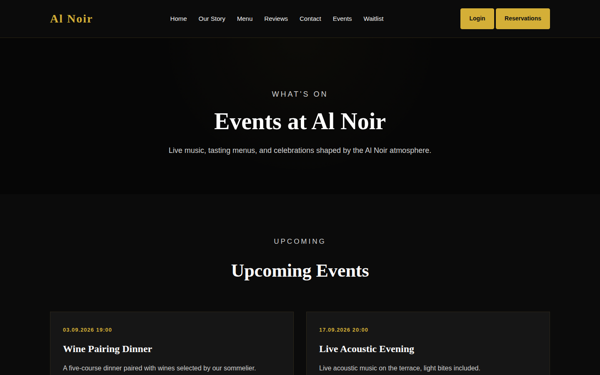
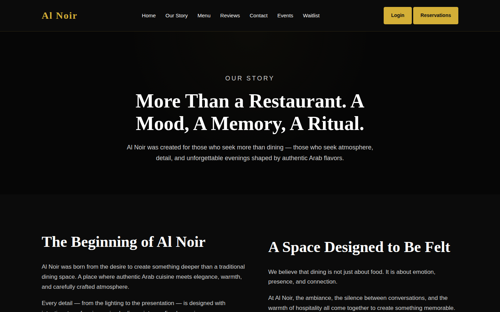

# Al Noir — Restaurant Management Platform

A full-stack Django application for a fine-dining restaurant: public site, table reservations with paid deposits, event ticketing, a staff back-office, and financial reporting — built and hardened end-to-end, then deployed live.

**Live demo:** https://al-noir.onrender.com
*(hosted on Render's free tier — the first request after a period of inactivity can take 30-50s to wake up)*

Demo content (menu, reviews, contact details) is fictional, seeded for demonstration purposes.

## Screenshots

| | |
|---|---|
|  |  |
|  |  |

<details>
<summary>More screenshots</summary>



</details>

---

## What this project demonstrates

This isn't a CRUD tutorial project. It started as an existing, untested Django codebase and went through a real audit-and-harden pass before deployment. A few examples of the kind of bugs that were found and fixed:

- **Race condition in loyalty points**: concurrent purchases could silently drop points because the balance was read-then-written instead of updated atomically — fixed with an atomic `F()` update.
- **Race condition in promo codes**: a promo code with a `max_uses` limit could be redeemed more times than allowed under concurrent requests — fixed with `select_for_update()` to lock the row during the check-and-increment.
- **Broken access control on payments**: any authenticated user who guessed a reservation's primary key could trigger the Stripe checkout for *someone else's* reservation. Fixed by requiring a unique, unguessable `access_token` per reservation.
- **Silent double-booking**: two reservations could be created for the same table and time slot with no constraint stopping it — fixed with a database-level `UniqueConstraint`.
- **Broken financial aggregation**: a report query aliased `quantity=Sum('quantity')`, which shadowed the real field and caused an aggregate-over-aggregate error — the report crashed on every single request until traced and fixed.
- **Unenforced event capacity**: `Event.capacity` existed as a field but was never checked, so events could be oversold without limit.

Every fix above was verified locally (`manage.py check`, `manage.py test`, and manual functional testing) before being committed — see commit history for the full list (13 bugs fixed across two audit passes).

## Feature overview

**Public site**
- Menu with categories, pricing, and loyalty-reward items
- Table reservations with an optional paid deposit via Stripe Checkout
- Event listings with ticket booking and a waitlist for sold-out slots
- Contact form (persisted to the DB and visible in Django admin)

**Client account**
- Dashboard showing reservation history, loyalty point balance, and redeemable rewards
- PDF invoice generation for paid reservations

**Staff back-office** (role-gated)
- Staff dashboard: stock levels (with low-stock and expiry warnings), sales, shift schedule
- Financial reports combining menu sales, event tickets, and reservation deposits over a selected date range, broken down by expense category
- Inventory auto-deduction: selling a menu item automatically creates a `StockMovement` against its linked `StockItem` — staff don't have to log stock manually for every sale

**Payments**
- Stripe Checkout for reservation deposits, with webhook-based confirmation (signature-verified) as the source of truth, and a browser-redirect fallback for the immediate UX path

## Tech stack

- **Backend:** Django 5.2, Django REST Framework
- **Database:** PostgreSQL (Neon) in production, SQLite for local dev
- **Payments:** Stripe Checkout + webhooks
- **Media storage:** Cloudinary
- **Static files:** WhiteNoise
- **Hosting:** Render (gunicorn, auto-deploy on push to `main`)
- **PDF generation:** for reservation invoices

## Architecture

The project is split into four Django apps by domain:

| App | Responsibility |
|---|---|
| `core` | Site settings, contact messages, reviews |
| `menu` | Menu categories and items |
| `reservations` | Tables, reservations, Stripe checkout/webhook |
| `operations` | Everything staff-facing: stock, sales, expenses, events, tickets, invoices, loyalty, promo codes, staff shifts, waitlist |

## Deployment notes

- **Zero hardcoded secrets** — `SECRET_KEY`, database URL, Stripe keys, and Cloudinary credentials are all environment variables; the app refuses to start in production without a real `SECRET_KEY`.
- **No shell access on Render's free tier**, so there's no way to run `createsuperuser` interactively — solved with an idempotent `ensure_superuser` management command that runs on every deploy from `DJANGO_SUPERUSER_*` env vars.
- **`STORAGES` vs `STATICFILES_STORAGE`** — Django 4.2+'s new `STORAGES` setting and `django-cloudinary-storage` (which only reads the legacy `STATICFILES_STORAGE`) had to be configured in parallel, plus `--upload-unhashed-files` on `collectstatic`, or static assets silently failed to deploy.
- **`SECURE_PROXY_SSL_HEADER` + `CSRF_TRUSTED_ORIGINS`** configured for Render's reverse proxy so CSRF checks and `request.is_secure()` behave correctly behind it.
- Reproducible via `render.yaml`, though the actual service was created through the Render dashboard (Blueprint deploys required a card on file at the time).

## Running locally

```bash
git clone https://github.com/SanduAndreea22/al_noir.git
cd al_noir
python -m venv venv
venv\Scripts\activate        # or: source venv/bin/activate
pip install -r requirements.txt
cp .env.example .env         # fill in your own values
python manage.py migrate
python manage.py runserver
```

Required environment variables are listed in `.env.example`. At minimum, local development needs `DJANGO_SECRET_KEY` and `DJANGO_DEBUG=True`; Stripe and Cloudinary keys are only needed to exercise those specific features.
